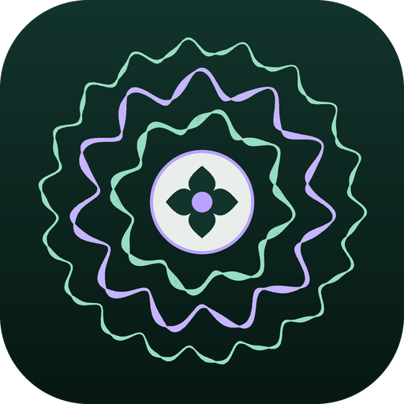
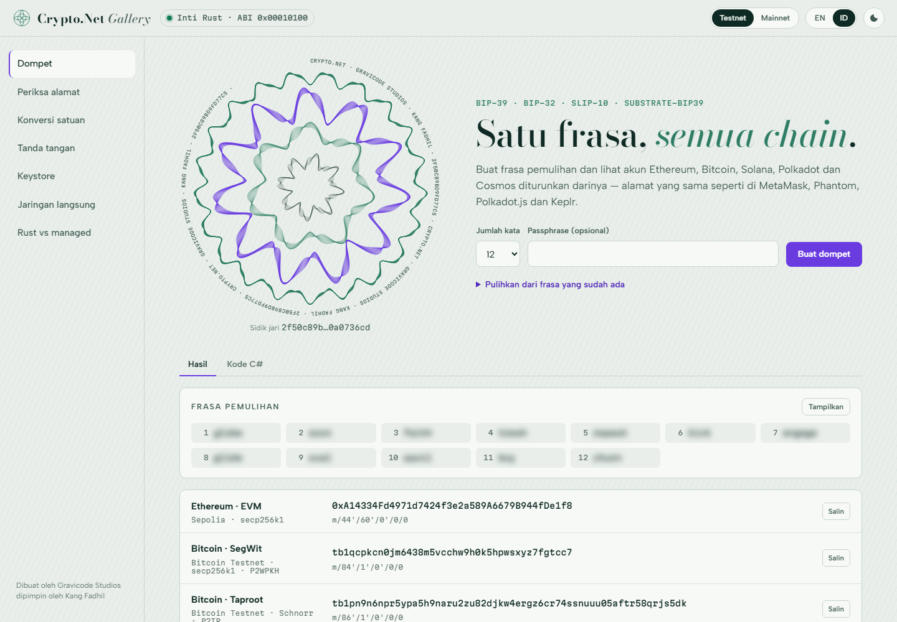
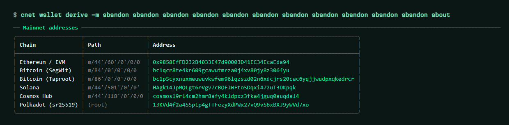
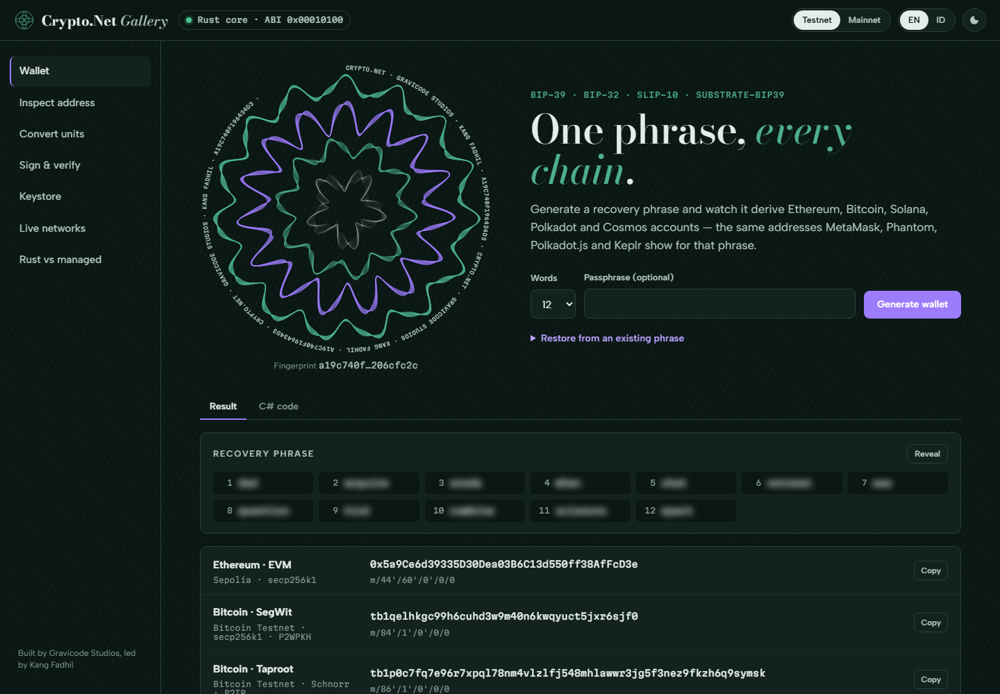

<p align="center">
  
</p>

<h1 align="center">Crypto.Net</h1>

<p align="center">
  <strong>Kriptografi multi-chain dan client blockchain untuk .NET 10, ditenagai inti Rust.</strong><br>
  Bitcoin · Ethereum &amp; EVM · Solana · Polkadot · Cosmos
</p>

<p align="center">
  <a href="README.md">English</a> ·
  <a href="docs/id/index.md">Dokumentasi</a> ·
  <a href="docs/en/index.md">Documentation</a> ·
  <a href="PLAN.md">Roadmap</a>
</p>

<p align="center">
  <a href="https://github.com/DotNetVibeCoderz/Vibe_Crypto/actions/workflows/cryptonet-ci.yml"></a>
  
  
  
  
</p>

<p align="center"><em>Dibuat oleh Gravicode Studios dipimpin oleh Kang Fadhil.</em></p>

<p align="center">
  
</p>

---

## Apa itu Crypto.Net

Crypto.Net memberi aplikasi .NET satu API yang konsisten untuk kunci, alamat, tanda tangan, transaksi dan RPC
di lima keluarga blockchain. Kriptografi berat berada di library Rust kecil (`cryptonet`) yang dibangun di atas
crate RustCrypto, dalek dan schnorrkel, dipanggil lewat C ABI. Setiap primitif juga punya implementasi C# murni
yang menghasilkan keluaran **identik per byte**, sehingga library tetap berjalan di platform tanpa binary native.

- **Benar sejak awal.** Diverifikasi terhadap test vector resmi: BIP-32/39/84/86, BIP-143, BIP-340, SLIP-10,
  RFC 6979/7914/8032, EIP-55/155/191/712, Web3 Secret Storage, dan `//Alice` milik Substrate. Mnemonic yang sama
  menghasilkan alamat yang sama dengan MetaMask, Phantom, Polkadot.js dan Keplr.
- **Cepat.** ECDSA, Schnorr dan Ed25519 berjalan 15–100× lebih cepat daripada kode managed (lihat [performa](#performa)).
- **Aman secara default.** Rahasia disimpan di `SecureBuffer` yang di-pin dan di-nol-kan; tanda tangan RFC 6979
  low-S; transfer disimulasikan sebelum ditandatangani; Gallery tidak pernah mem-broadcast transaksi.
- **Pragmatis.** Async, ramah DI (`AddCryptoNet`), `IHttpClientFactory` + resilience, lapisan native kompatibel AOT.

## Paket

| Paket | Isi |
| --- | --- |
| `Crypto.Net.Native` | Inti Rust + fallback managed: SHA-2, Keccak, BLAKE2b, RIPEMD-160, secp256k1 ECDSA/Schnorr/Taproot, Ed25519, sr25519, BIP-32, SLIP-10, PBKDF2, scrypt, Base58, Bech32/Bech32m |
| `Crypto.Net.Core` | `Amount` (pasti), `Address`, `TxHash`, `ISigner`, `IChainClient`, transport JSON-RPC, polling receipt |
| `Crypto.Net.Wallet` | Mnemonic BIP-39, kunci HD BIP-32/SLIP-10, xprv/xpub/zpub, keystore Web3 v3, `KeySigner` |
| `Crypto.Net.Evm` | EIP-55, transaksi Legacy/EIP-2930/EIP-1559, codec ABI, EIP-191/712, ERC-20, client JSON-RPC |
| `Crypto.Net.Bitcoin` | P2PKH/P2SH/P2WPKH/P2WSH/P2TR, serialisasi SegWit, signing legacy/BIP-143/BIP-341, coin selection, Esplora |
| `Crypto.Net.Solana` | Transaksi, System/SPL Token/ATA/Compute Budget/Memo, PDA, kunci Phantom & solana-cli, RPC |
| `Crypto.Net.Polkadot` | SS58, derivasi Substrate sr25519/ed25519, SCALE, extrinsic berbasis metadata runtime, RPC |
| `Crypto.Net.Cosmos` | Akun Bech32, protobuf `SIGN_MODE_DIRECT` (bank, staking, distribution), client REST |
| `Crypto.Net.Extensions` | `AddCryptoNet()` dengan client ber-key, resilience, `ChainCatalog`, penyedia Ankr/dRPC, benchmark |
| `Crypto.Net.Testing` | `MockHttpMessageHandler` dan test vector resmi |
| `Crypto.Net.Cli` | Tool dotnet `cnet` |

```bash
dotnet add package Crypto.Net.Extensions   # menarik semua chain
dotnet tool install -g Crypto.Net.Cli      # perintah cnet
```

## Mulai cepat

```csharp
using var wallet = HdWallet.Generate(wordCount: 12);           // cadangkan wallet.RevealMnemonic()

using var eth  = wallet.GetEvmAccount(0, EvmChain.Sepolia);    // m/44'/60'/0'/0/0
using var btc  = wallet.GetBitcoinAccount(BitcoinAddressType.TaprootP2TR, 0, BitcoinNetwork.Testnet);
using var sol  = wallet.GetSolanaAccount(0, SolanaChain.Devnet);
using var dot  = wallet.GetPolkadotAccount("", PolkadotChain.Westend);   // sr25519, kompatibel Polkadot.js
using var atom = wallet.GetCosmosAccount(0, CosmosChain.CosmosHubTestnet);
```

Mengirim di setiap chain (contoh di testnet):

```csharp
await using var evm = new EvmRpcClient(EvmChain.Sepolia);
await using var signer = eth.CreateSigner();
TxHash h1 = await evm.TransferAsync(signer, "0x…", Amount.FromEther(0.01m));   // nonce, fee EIP-1559, gas, simulasi
var receipt = await evm.WaitForReceiptAsync(h1);

await using var esplora = new EsploraClient(BitcoinNetwork.Testnet);
TxHash h2 = await esplora.TransferAsync(btc, "tb1q…", amountSats: 25_000);       // UTXO, coin selection, Schnorr

await using var solana = new SolanaRpcClient(SolanaChain.Devnet);
TxHash h3 = await solana.TransferAsync(sol, "9xQe…", Amount.FromSol(0.1m));

await using var westend = new PolkadotRpcClient(PolkadotChain.Westend);
TxHash h4 = await westend.TransferAsync(dot, "5Grw…", Amount.Parse("0.5", 12));  // indeks pallet/call dari metadata live

await using var cosmos = new CosmosRestClient(CosmosChain.CosmosHubTestnet);
TxHash h5 = await cosmos.TransferAsync(atom, "cosmos1…", Amount.FromAtom(0.2m));
```

Kode ini juga tersedia sebagai program yang bisa dijalankan: `dotnet run --project samples/Crypto.Net.QuickStart`.

Dengan dependency injection:

```csharp
builder.Services.AddCryptoNet(c => c
    .AddEvm("eth", o => o.Network = EvmChain.Sepolia)
    .AddSolana("sol", o => o.Cluster = SolanaChain.Devnet)
    .AddBitcoin("btc")
    .WithResilience());
```

### Penyedia RPC dengan API key (Ankr, dRPC)

Endpoint publik dibatasi laju (rate limit). Tambahkan API key dan client EVM, Solana dan Substrate akan memakainya
lebih dulu. Jika penyedia menolak suatu jaringan atau membatasi laju, client otomatis berpindah ke penyedia
berikutnya, lalu ke node publik. Permintaan yang sudah *dieksekusi* tidak pernah diulang di tempat lain.

```csharp
builder.Services.AddCryptoNet(c => c
    .UseAnkr(builder.Configuration["Ankr:ApiKey"]!)
    .UseDrpc(builder.Configuration["Drpc:ApiKey"]!)
    .AddEvm("eth", o => o.Network = EvmChain.Ethereum));
```

CLI, Gallery dan `ChainCatalog` membaca `CRYPTONET_ANKR_KEY` dan `CRYPTONET_DRPC_KEY` (bisa dipersempit dengan
`CRYPTONET_ANKR_NETWORKS=ethereum,polygon`). Kunci dRPC dikirim lewat header; kunci Ankr menjadi bagian URL,
sehingga Crypto.Net mematikan logging HTTP untuk client ber-key. Simpan kunci di user-secrets atau variabel
lingkungan, jangan pernah di source control.

## Notebook

Enam notebook .NET interaktif — dompet, Bitcoin, Ethereum/EVM, Solana, Polkadot dan Cosmos — dalam bahasa
Inggris dan Indonesia: [samples/notebooks](samples/notebooks/README.md). Buka di VS Code dengan Polyglot Notebooks.

## Perintah `cnet`

```bash
cnet doctor                              # library native, ABI, RID, penyedia RPC
cnet wallet new --words 24               # frasa + alamat di semua chain
cnet address validate <alamat>           # mendeteksi chain, memeriksa checksum
cnet convert 1.5 ether gwei              # konversi satuan yang pasti
cnet balance <alamat> -N sepolia         # saldo live lewat client bawaan
cnet sign message "halo" -m "<frasa>"    # EIP-191; `sign typed-data` untuk EIP-712
cnet keystore encrypt -k <hex>           # keystore Web3 v3 (geth / MetaMask)
cnet bench                               # Rust vs managed di mesin ini
```

<p align="center"></p>

## Gallery

Studio interaktif (ASP.NET Core) untuk setiap fitur: derivasi dompet dengan "sidik jari" guilloché dari seed,
pemeriksaan alamat, konversi satuan yang pasti, lima skema tanda tangan, keystore, blok terbaru jaringan secara
live, dan benchmark Rust vs managed — masing-masing lengkap dengan kode C#-nya. Bahasa Inggris dan Indonesia,
tema terang dan gelap, testnet secara default.

```bash
dotnet run --project samples/Crypto.Net.Gallery   # http://localhost:5080
```

| | |
| --- | --- |
|  |  |
|  |  |

## Performa

`cnet bench` di laptop Windows x64 (operasi per detik, makin tinggi makin baik):

| Operasi | Inti Rust | C# managed | Percepatan |
| --- | ---: | ---: | ---: |
| Keccak-256 (256 B) | 752.495 | 20.150 | 37× |
| BLAKE2b-256 (256 B) | 2.370.230 | 82.408 | 29× |
| Public key secp256k1 | 14.864 | 297 | 50× |
| ECDSA sign (RFC 6979) | 7.171 | 303 | 24× |
| ECDSA verify | 7.611 | 217 | 35× |
| Schnorr sign (BIP-340) | 3.813 | 254 | 15× |
| Ed25519 sign | 20.629 | 234 | 88× |
| Ed25519 verify | 21.127 | 200 | 106× |
| SHA-256 (256 B) | 541.470 | 510.103 | 1,1× |

SHA-2, HMAC dan PBKDF2 sudah diakselerasi hardware oleh stack kripto OS, sehingga backend default `Auto` memakai
platform untuk ketiganya dan Rust untuk sisanya. Paksa salah satu mesin dengan `CryptoNative.UseBackend(...)`
atau `CRYPTONET_BACKEND=native|managed`.

## Arsitektur

```
 Aplikasi:    CLI cnet · Gallery (ASP.NET Core) · kode Anda
 DI:          Crypto.Net.Extensions   AddCryptoNet() · ChainCatalog · Ankr/dRPC · resilience
 Chain:       .Evm  .Bitcoin  .Solana  .Polkadot  .Cosmos
 Wallet/Core: .Wallet (BIP-39/32, SLIP-10, keystore)  ·  .Core (Amount, ISigner, IChainClient, JSON-RPC)
 Native:      Crypto.Net.Native  → CryptoNative (Auto | Native | Managed) → P/Invoke atau fallback managed
 ─────────────────────────── C ABI (cn_*, kode status i32, catch_unwind) ───────────────────────────
 Rust:        cryptonet-ffi → cryptonet-crypto (k256, ed25519-dalek, schnorrkel, scrypt…) · cryptonet-codec
```

Detail: [docs/id/arsitektur.md](docs/id/arsitektur.md).

## Build dari source

Kebutuhan: .NET 10 SDK, Rust (stable) untuk library native. CI membangun binary native untuk Windows, Linux dan
macOS (x64 dan arm64); rilis dipublikasikan dari tag `CryptoNet-v*`.

```powershell
./scripts/build-native.ps1          # cargo test + build release, salin ke runtimes/<rid>/native
dotnet test tests/Crypto.Net.Tests  # 95 test (3 test jaringan live jalan dengan CRYPTONET_LIVE_TESTS=1)
./scripts/pack.ps1                  # paket NuGet di ./artifacts
```

## Keamanan

Crypto.Net belum diaudit pihak eksternal. Gunakan testnet selama evaluasi, jangan pernah commit mnemonic atau private
key, dan baca [docs/id/keamanan.md](docs/id/keamanan.md). Laporkan kerentanan secara privat sesuai [SECURITY.md](SECURITY.md).

## Lisensi

MIT © 2026 Gravicode Studios. **Dibuat oleh Gravicode Studios dipimpin oleh Kang Fadhil.**
