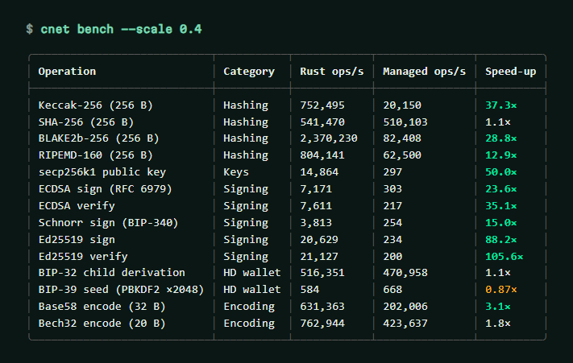
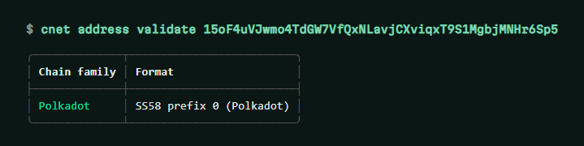

# The `cnet` command line

[← Documentation](index.md) · [Bahasa Indonesia](../id/cli.md)

```bash
dotnet tool install -g Crypto.Net.Cli
cnet --help
```

Every command accepts `--json` for scripting. Secrets can come from options, the environment
(`CNET_MNEMONIC`, `CNET_PRIVATE_KEY`) or a hidden prompt — prefer the latter two so they stay out of shell history.

| Command | What it does |
| --- | --- |
| `cnet doctor` | Native library status, ABI, RID, OS, .NET, configured RPC providers |
| `cnet networks` | Every built-in network key (use them with `-N`) |
| `cnet wallet new [--words 24] [--passphrase …] [--testnet]` | New phrase plus addresses on all chains |
| `cnet wallet derive -m "<phrase>" [-n 5] [--show-keys]` | Addresses (and optionally keys) for indexes 0..n-1 |
| `cnet wallet xpub -m "<phrase>"` | BIP-44/84/86 account xpub, zpub, tpub… |
| `cnet keystore encrypt -k <hex> [--kdf standard\|light\|pbkdf2] [-o file]` | Web3 v3 keystore |
| `cnet keystore decrypt <file> [--show-key]` | Checks the password and prints the address |
| `cnet address validate <address> [-N network]` | Detects chains, verifies checksums |
| `cnet convert <amount> <from> <to>` | Exact unit conversion (wei/gwei/ether, sat/btc, lamports/sol, planck/dot, uatom/atom) |
| `cnet balance <address> -N <network> [--rpc url]` | Live native balance |
| `cnet block -N <network>` | Latest block height or slot |
| `cnet tx <hash> -N <network>` | Receipt (exit code 2 while pending) |
| `cnet sign message "<text>" (-k <hex> \| -m "<phrase>" [-i index])` | EIP-191 signature |
| `cnet sign typed-data <file.json> …` | EIP-712 digest and signature |
| `cnet verify "<text>" -s <signature>` | Recovers the signer address |
| `cnet bench [--scale 1.0]` | Rust core vs managed C# on this machine |





Environment variables: `CRYPTONET_ANKR_KEY`, `CRYPTONET_DRPC_KEY` (+ `_NETWORKS`) route RPC calls through keyed
providers; `CRYPTONET_BACKEND=native|managed` forces an engine; `CRYPTONET_NATIVE_PATH` points at a custom build
of the native library.
