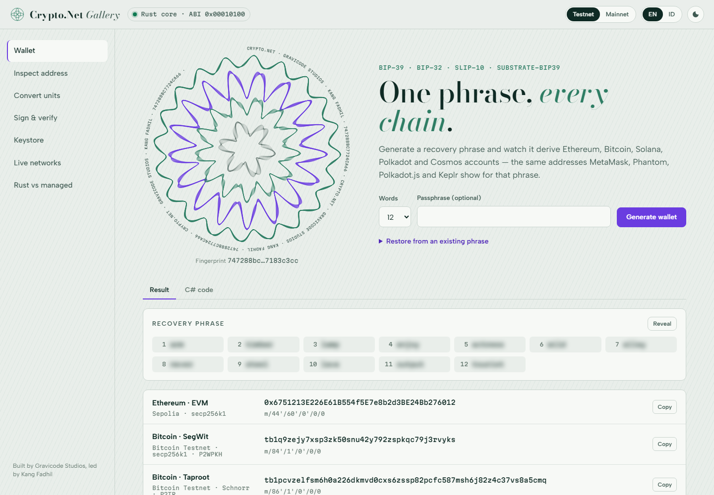
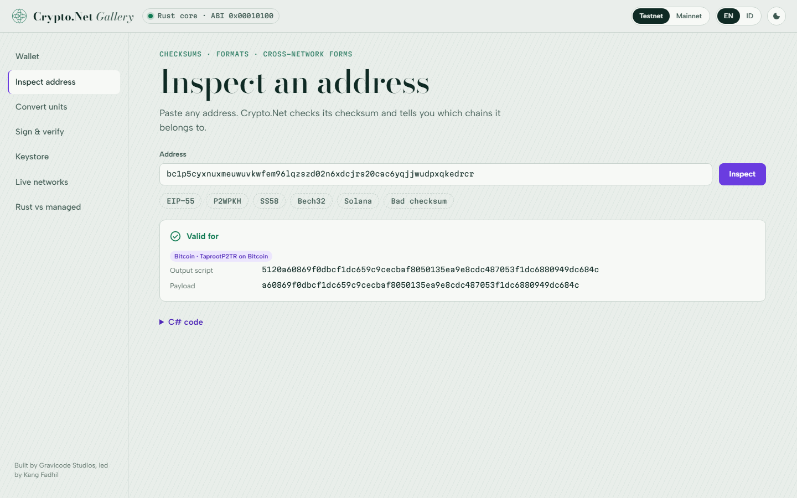
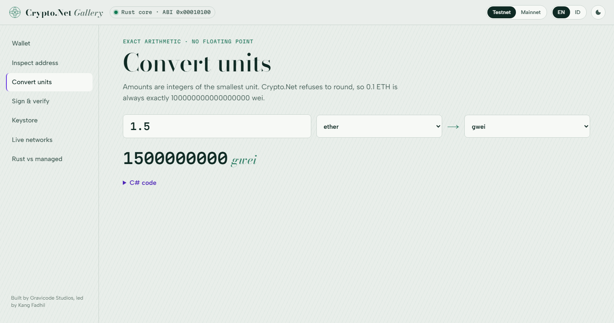
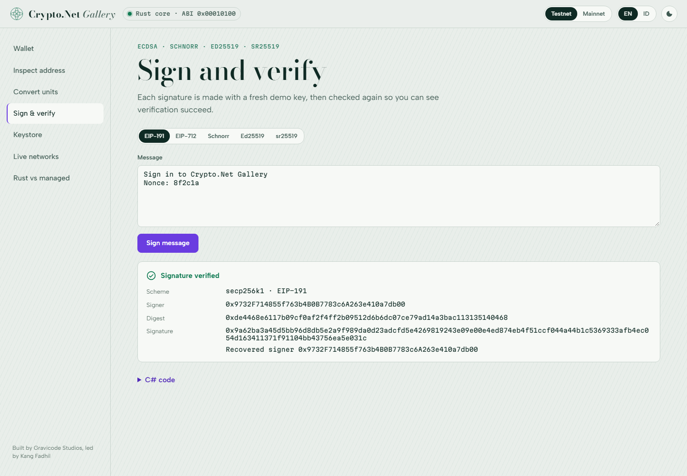
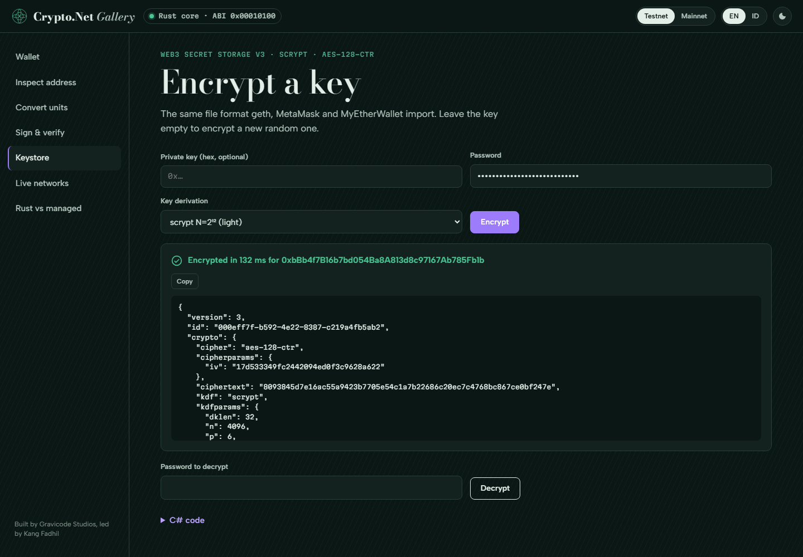
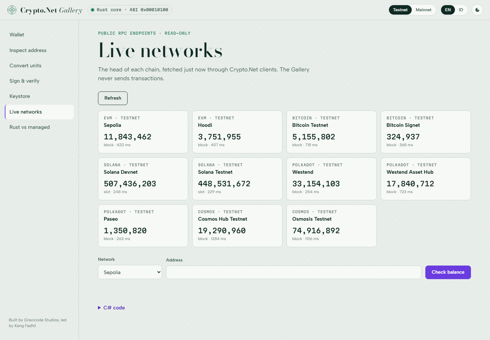
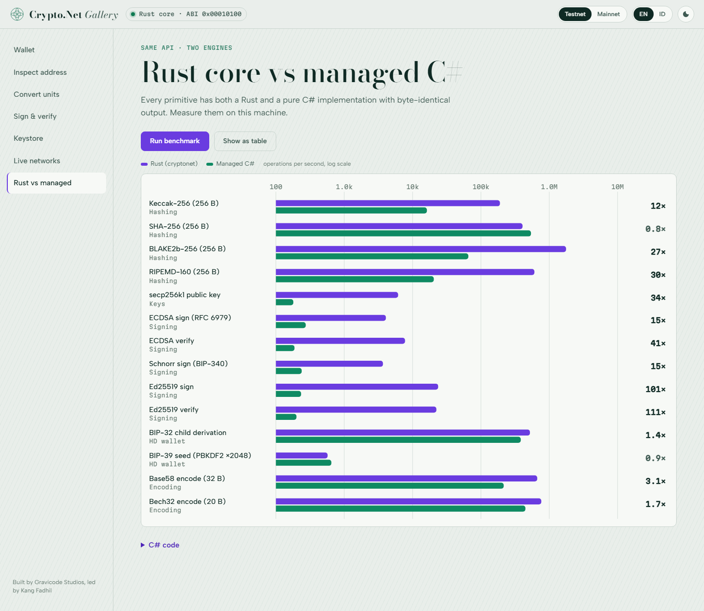
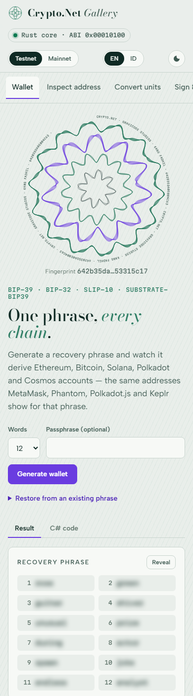

# The Gallery

[← Documentation](index.md) · [Bahasa Indonesia](../id/gallery.md)

The Gallery is an interactive studio for every Crypto.Net feature. Each page runs the real library on the server
and shows the C# that does the same thing.

```bash
dotnet run --project samples/Crypto.Net.Gallery
# open http://localhost:5080
```

Set `CRYPTONET_ANKR_KEY` / `CRYPTONET_DRPC_KEY` before starting it to read networks through your providers.

**Safe sandbox.** The Gallery never broadcasts transactions. Keys it creates are demo keys that live in memory for
one request. Testnet is the default; switching to mainnet shows a warning banner.

| Page | What you can do |
| --- | --- |
| Wallet | Generate or restore a phrase and see the Ethereum, Bitcoin SegWit/Taproot, Solana, Polkadot and Cosmos accounts. The guilloché rosette is a visual fingerprint drawn from the wallet's xpub, not from the secret. |
| Inspect address | Paste any address to see which chains accept it, its output script, and its form on other networks. |
| Convert units | Exact conversion between every unit of a chain, live as you type. |
| Sign & verify | EIP-191, EIP-712, BIP-340 Schnorr, Ed25519 and sr25519 signatures, each verified again. |
| Keystore | Encrypt a key to a Web3 v3 file and decrypt it again. |
| Live networks | The head of every network through Crypto.Net clients, plus a balance lookup. |
| Rust vs managed | Benchmark both engines with a chart (log scale) or table. |

Interface languages: English and Bahasa Indonesia (EN/ID toggle). Themes: light and dark, following the system
by default. Layout works down to phone width.










URL parameters for screenshots and demos: `?theme=light|dark`, `?lang=en|id`, `?still=1` (no animation),
`?autorun=1` (runs the page's action on open).
