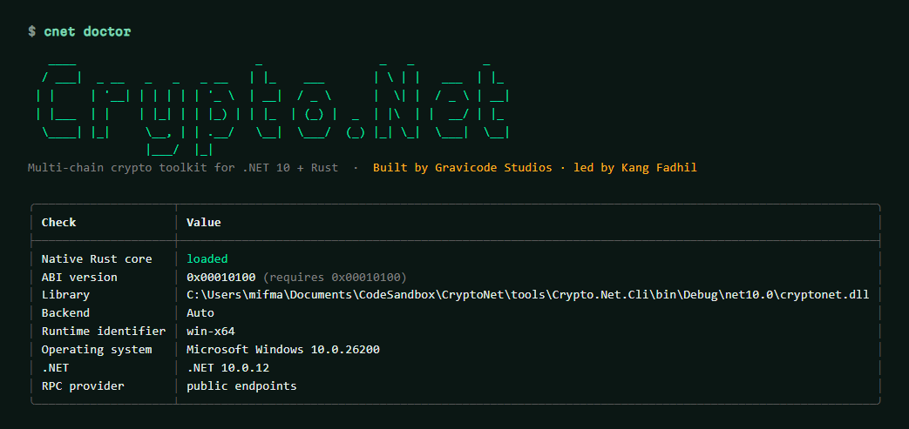

# Getting started

[← Documentation](index.md) · [Bahasa Indonesia](../id/memulai.md)

## Install

```bash
dotnet add package Crypto.Net.Extensions   # everything: core, wallet, five chains, DI
# or pick only what you need:
dotnet add package Crypto.Net.Evm
dotnet add package Crypto.Net.Bitcoin
```

Requirements: .NET 10. The `Crypto.Net.Native` package carries the Rust library under
`runtimes/<rid>/native`; when no binary exists for your platform the managed implementation is used
automatically (sr25519 is the one feature that needs the native library). Check with:

```bash
dotnet tool install -g Crypto.Net.Cli
cnet doctor
```



## 1. Create a wallet

```csharp
using Crypto.Net.Wallet;
using Crypto.Net.Evm;

using var wallet = HdWallet.Generate(wordCount: 12);
string phrase = wallet.RevealMnemonic();          // show once, store offline

using var account = wallet.GetEvmAccount(index: 0, EvmChain.Sepolia);
Console.WriteLine(account.Address);               // 0x… (EIP-55)
```

Restoring is the same call with `HdWallet.FromMnemonic(phrase, passphrase)`. The same phrase gives the same
addresses as MetaMask, Phantom, Polkadot.js and Keplr — see [Wallets and keys](wallet-and-keys.md).

## 2. Read from a network

```csharp
await using var client = new EvmRpcClient(EvmChain.Sepolia);
Amount balance = await client.GetBalanceAsync(account.Address);
Console.WriteLine($"{balance} ETH");
```

## 3. Sign a message

```csharp
byte[] signature = account.SignMessage("Sign in to example.com");             // EIP-191
string signer = EvmMessageSigner.RecoverPersonalMessageSigner("Sign in to example.com", HexUtil.Encode(signature));
```

## 4. Send a transaction (testnet)

```csharp
await using var signer = account.CreateSigner();
TxHash hash = await client.TransferAsync(signer, "0xRecipient…", Amount.FromEther(0.001m));
TxReceipt receipt = await client.WaitForReceiptAsync(hash);
```

`TransferAsync` fetches the nonce, suggests EIP-1559 fees, simulates the call with `eth_estimateGas` (a revert
fails here, before anything is signed), signs and broadcasts.

## 5. Every chain at once

The [quick-start sample](../../samples/Crypto.Net.QuickStart/Program.cs) derives accounts on all five chains,
signs offline, reads chain heads through dependency injection and, with `--send "<phrase>"`, broadcasts tiny
self-transfers on testnets:

```bash
dotnet run --project samples/Crypto.Net.QuickStart
```

## 6. Learn interactively

The [notebooks](../../samples/notebooks/README.md) walk through each chain step by step with live
network reads (English and Bahasa Indonesia).

Next: [Concepts](concepts.md).
